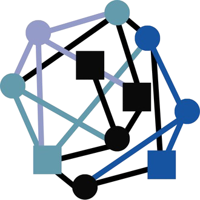

# povezava.si

Sanja Muršič, Chantal Pia Ribič, Tara Sedovšek

## 🔗Vizija

Povezava.si je spletna platforma za pregled in vizualizacijo povezav med slovenskimi podjetji, osebami in organizacijami na podlagi javno dostopnih podatkov. Platforma uporabnikom omogoča iskanje subjektov, prikaz povezav v interaktivnem grafu ter pregled osnovnih informacij o podjetjih in njihovih vlogah. Namenjena je predvsem lažjemu razumevanju poslovnih in organizacijskih povezav brez potrebe po tehničnem znanju.

## Podatki za delo

## Tehhnološki nabor

## Namestitev in zagon projekta
1. _Predpogoji_
   Za namestitev je nujno potrebno, da je na računalnik nameščeno naslednje:
   - [Docker]
   - [Git](https://git-scm.com/downloads)
     - Preveri namestitev: `git --version`
   - Node.js in npm  
        Node.js verzija 18 ali višja, npm verzija 6 ali višja
   - namestitev: https://nodejs.org/en
   - preverjanje namestitev v terminalu: `node -v` in `npm -v`
   2. Git  
      Potreben je za kloniranje repozitorija
   - namestitev: https://git-scm.com/downloads
   - preverjanje namestitve z ukazom: `git --version`
     
3. _Zagon aplikacije z Dockerjem_
