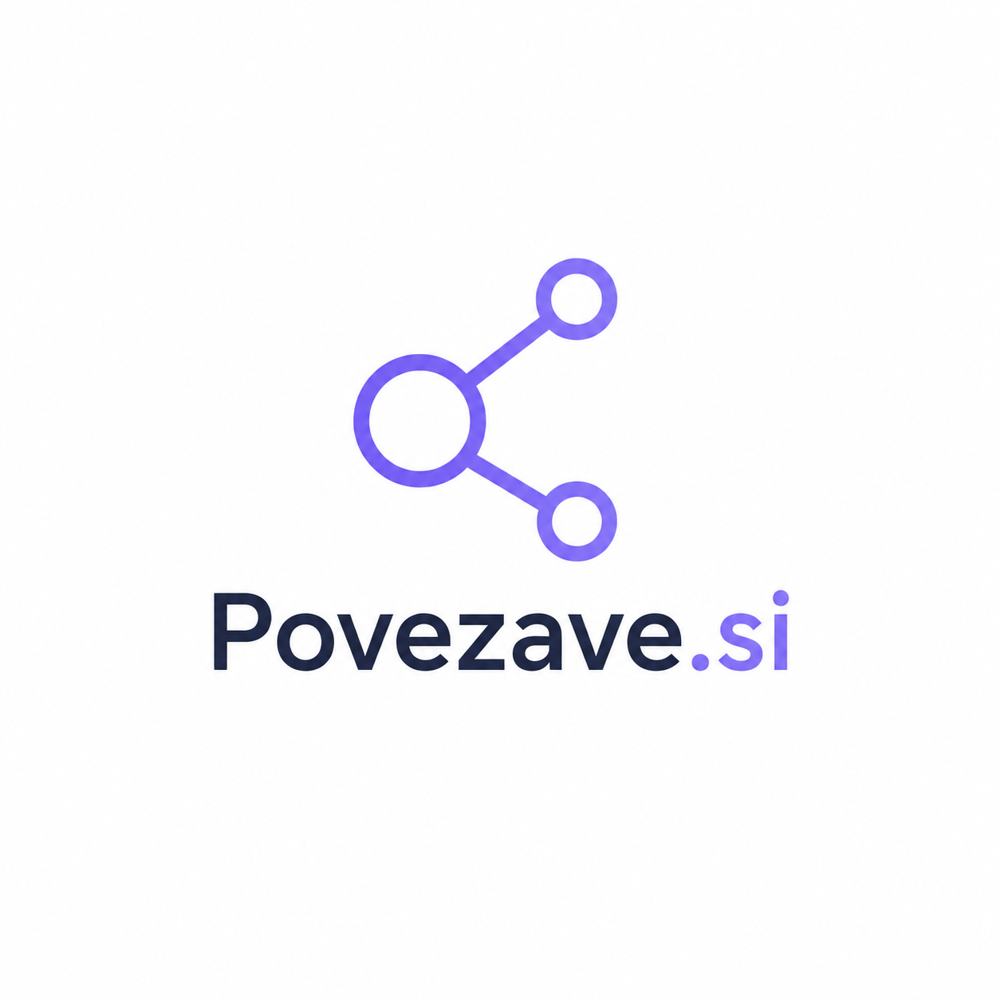
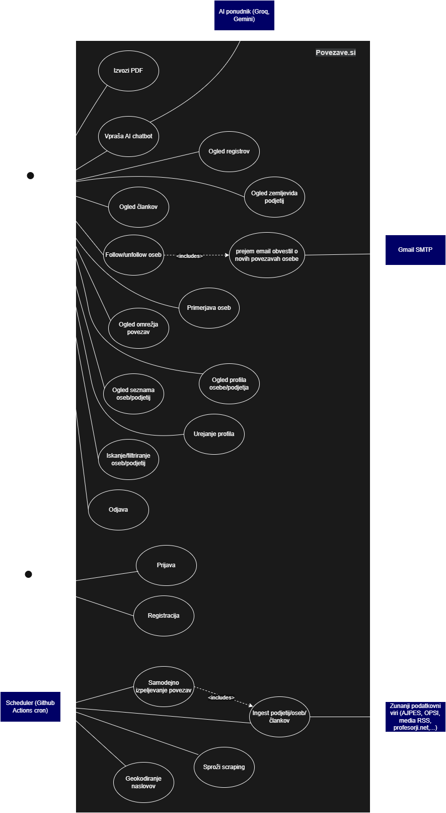

<p align="center">

<br>
<a href="https://povezava-si.vercel.app/">Povezava.si</a>
</p>
<p align="center">
Avtorji: Sanja Muršič, Chantal Pia Ribič, Tara Sedovšek
</p>
<p align="center">
Povezava.si je spletna platforma za pregled in vizualizacijo povezav med slovenskimi podjetji, osebami in organizacijami na podlagi javno dostopnih podatkov. Uporabnikom omogoča iskanje subjektov, prikaz povezav v interaktivnem grafu ter pregled osnovnih informacij o podjetjih in njihovih vlogah.
</p>

## Kazalo

- [O projektu](#o-projektu)
- [Glavne funkcionalnosti](#glavne-funkcionalnosti)
    - [Diagram primerov uporabe](#diagram-primerov-uporabe)
- [Pridobivanje virov](#pridobivanje-virov)
    - [Podjetja](#podjetja)
    - [Osebe in lastniki podjetji](#osebe-in-lastniki-podjetji)
    - [Profesorji](#profesorji)
    - [Članki](#članki)
    - [Lobisti in kazensko ovadene osebe](#lobisti-in-kazensko-ovadene-osebe)

<br>
Podrobnejša dokumentacija projekta je znotraj mape /docs


## O projektu


Povezava.si je nastala kot projekt v okviru študija na Fakulteti za elektrotehniko, računalništvo in informatiko Univerze v Mariboru. Namen platforme je narediti povezave med slovenskimi podjetji, osebami in organizacijami vidne in razumljive informacije, ki so sicer razpršene po različnih javnih registrih, tukaj združimo v enoten, iskalen in vizualno pregleden sistem.

Osrčje aplikacije predstavlja podatkovna baza, zgrajena z avtomatiziranim zajemom podatkov iz javno dostopnih virov, med drugim OPSI, AJPES, ERAR in KPK. Podatke o podjetjih in njihovih lastnikih pridobivamo s po meri razvitimi Python scraperji, ki zaradi obsega podatkov delujejo prek vzporednih delavcev (workerjev), s čimer smo čas zajema skrajšale iz predvidenih 80 dni na bistveno krajše obdobje. Ob tem samodejno zaznavamo in združujemo podvojene zapise oseb, kar zagotavlja čistejšo in zanesljivejšo bazo.

Povezave med subjekti, podjetji, osebami, regijami in mediji, gradimo po principu "šest stopenj ločenosti" (six degrees of separation), ki omogoča iskanje najkrajše poti oziroma povezanosti med poljubnima dvema subjektoma v grafu. Za dodatno globino razumevanja povezav smo vključile jezikovni model (Anthropic), ki uporabniku v naravnem jeziku razloži, zakaj in kako sta dva subjekta povezana.

Uporabnik lahko subjekte išče in filtrira po panogi, si ogleda njihov profil s ključnimi podatki in aktivnostjo, jih med seboj primerja ter si podatke izvozi v PDF. Podjetja so prikazana tudi na interaktivnem zemljevidu Slovenije, kjer je lokacije mogoče geokodirati, filtrirati in iskati. Za dodatno kontekstualizacijo povezujemo subjekte tudi z novičarskimi članki, zajetimi iz slovenskih medijev.


## Glavne funkcionalnosti
 - Registracija in prijava
 - Iskanje oseb in podjetji
 - Interaktivni graf
 - Pregled profila osebe ali podjetja
 - primerjava med podjetji/osebami
 - pregled člankov, ki so povezani z osebami
 - uporaba umetne inteligence za razlago povezav

Podrobna sistemska zasnova in projektna organizacija sta opisani v datoteki [`SZPO.pdf`](./dokumentacija/SZPO.pdf)

### Diagram primerov uporabe

<picture>
  
</picture>

## Pridobivanje virov
Podatki, uporabljeni v platformi, izvirajo iz več javno dostopnih virov in so bili pridobljeni na različne načine. Zaradi obsega in narave podatkov niso vključeni neposredno v repozitorij.

> [!WARNING]
> TODO: popravi vire
### Podjetja
Osnovni seznam podjetij smo pridobile iz portala **[OPSI](https://podatki.gov.si/dataset/poslovni-register-slovenije)** (Odprti podatki Slovenije). Za podrobnejše podatke o posameznih podjetjih smo se obrnile na **[AJPES](https://www.ajpes.si/)**, ki nam je posredoval testne podatke za 40 podjetij. 

Za pridobivanje podatkov o preostalih podjetjih smo razvile Python skripte za avtomatski zajem podatkov s spletne strani AJPES. Skripte so dostopne v repozitoriju 
```bash
cd .\BE\python\
```
in jo lahko lokalno zaženete z ukazom 
```bash
python .\scraperOsebe+podjetjeDetails.py
```
Ker bi poplno pridobivanje vseh podatkov trajalo predvidoma **80 dni**, smo implementirale vzporedne delavce (workers), ki so čas skrajšali. Kljub optimizaciji je bil postopek zaradi velike količine podatkov še vedno dolgotrajen. Za lokalni zagon skripte storite na naslednji način: 
```bash
cd .\BE\python\
``` 
```bash
python .\ajpes_workerji.py
```

### Osebe in lastniki podjetji
Podatke o osebah smo pridobivale podobno kot podatke o podjetjih. Pri subjektih, ki v imenu vsebujejo ime osebe in oznako **s.p.** (samostojni podjetnik), smo ime osebe avtomatsko določile kot lastnika. S tem smo zmanjšale količino ročnega preverjanja in skrajšale čas zbiranja podatkov.

Preostale lastnike smo določile s pomočjo Python skripte `ajpes_workerji.py`, kjer je zagon datoteke naveden zgoraj pod poglavjem `Podjetja`. elotno izvajanje tega postopka bi trajalo približno **20 dni**.

### Profesorji
Podatke o profesorjih smo pridobile z avtomatskim zajemom podatkov z uradnih spletnih strani posameznih fakultet. Kot dodatni vir in pomoč pri čiščenju ter usklajevanju podatkov smo uporabile portal **[Profesorji.net](https://www.profesorji.net/)**, kjer smo prečistile in dopolnile manjkajoče ali nedosledne vnose.

### Članki 
Novice in članke, povezane s subjekti, smo pridobile z avtomatskim zajemom podatkov iz medijev: **[24ur](https://www.24ur.com/)**, **[Delo](https://www.delo.si/)** in drugih RSS virov.

### Lobisti in kazensko ovadene osebe
Podatke o lobistih in kazensko ovadenih smo pridobile iz naslednjih javno dostopnih virov: 
- **[ERAR](https://erar.si/)** — register lobistov in podatki o financiranju
- **[KPK](https://www.kpk-rs.si/)** (Komisija za preprečevanje korupcije)

> [!NOTE]
> Za podrobna navodila za zagon glej razdelek [Namestitev in zagon](#namestitev-in-zagon-projekta).


## Tehhnološki nabor
- Frontend: 
   - React (VITE v19.2.6)
   - JavaScript
   - Css
- Backend:
   - Node.js (v24.15.0)
   - Express

## Diagrami 

### er diagram
še bo dodan

### dpu
še bo dodan

### diagram baze
še bo dodan

### api,...
še bo dodan

## Struktura projekta 

### Pomembne podatkte

## Supabase povezava

## Environment datoteke
### API Keys

## Baza

## Namestitev in zagon projekta
1. _Predpogoji_
   Za namestitev je nujno potrebno, da je na računalnik nameščeno naslednje:
   - [Git](https://git-scm.com/downloads)
     - Preveri namestitev: `git --version`
   - Node.js in npm <br>
        Node.js verzija 18 ali višja, npm verzija 6 ali višja
   - namestitev: https://nodejs.org/en
   - preverjanje namestitev v terminalu: `node -v` in `npm -v`
   2. Git <br>
      Potreben je za kloniranje repozitorija
   - namestitev: https://git-scm.com/downloads
   - preverjanje namestitve z ukazom: `git --version`
     
2. _Kloniranje repozitorija z ukazi_
   - `https://github.com/Tara2712/povezava.si.git`
   - `cd povezava.si`

3. _Zagon aplikacije_

## Testiranje Backenda

## Testiranje Frontenda
- Unit oz. Component testi
- Vsi testi v mapi /FE/src/test
- React Testing Library
- Zagon: `cd ./FE` in nato `npm run test`

## Za razvijalce
## Sledenje napakam
## Česa ne commitat

## Podatki za delo

Podatki, uporabljeni pri razvoju projekta, niso vključeni v repozitorij kot datoteke, saj izvirajo iz javno dostopnih virov. Uporabili smo podatke, dostopne na straneh, kot so OPSI, AJPES, ERAR, RT Slovenija in drugi javni viri.

za potrebe projekta smo zbrale, uredile in shranile v namensko podatkovno bazo, ki jo uporablja aplikacija.Zaradi preglednosti in velikosti podatkovnih datotek te niso naložene neposredno v Git repozitorij.


